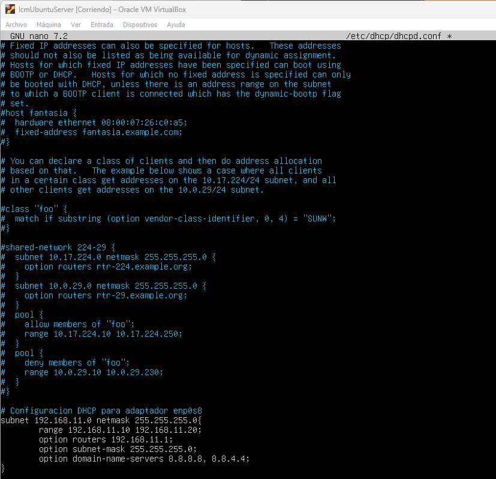
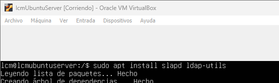
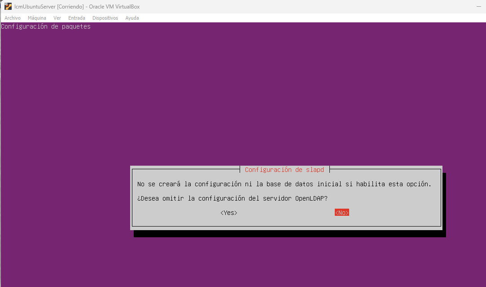
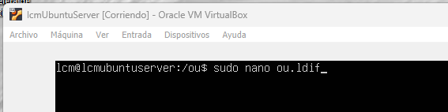

# Open LDAP
## Índice
- Instalación y configuración de VM
  - Creación máquinas
  - Configuración lcmUbuntuServer
    - Configuración DHCP
    - Configuración router
  - Configuración lcmUbuntuCliente
- Configuración dominio
- Instalación y configuración de LDAP
  - Creación UO
  - Creación de grupos
  - Creación de usuarios

## Instalación y configuración de VM
Vamos a crear dos máquinas virtuales según la tabla: 
|VM|SO|red|
|--|--|-|
|A1.1-Ubuntu_Cliente|Ubuntu 24.04| 1 adaptador (red interna)|
|A1.1-Ubuntu_Server|Ubuntu Server 24.04| 2 adaptadores (red interna,adaptador puente)|

### Creación máquinas
Generamos dos máquinas nuevas en VBox    
   
Configuramos ambas máquinas con suficiente RAM y CPU para la práctica, en nuestro caso asignamos 4GB de RAM y 2 CPU  
 

Una vez nuestras máquinas están creadas vamos a establecer la configuración de red  
Para la máquina A1.1-Ubuntu_Cliente establecemos un único adaptador de red en modo **Red interna** *ASIR_local*  
  
Para la máquina A1.1-Ubuntu_Server establecemos dos adaptadores de red, uno en modo **Red interna** *ASIR_local* y otro en modo **Adaptador Puente**  
 

Iniciamos las máquinas e instalamos los correspondientes SO.
*NOTA: Es recomendable apuntar las MAC de los correspondientes adaptadores de red de cada máquina para facilitarnos el trabajo más adelante*

### Configuración lcmUbuntuServer
Para nuestra máquina server debemos gestionar varias configuraciones adicionales para poder realizar la práctica. Además la instalación del SO Ubuntu Server difiere bastante de la instalación de un Ubuntu regular escritorio, por eso vamos a pararnos un poco en la instalación del SO.  
*Destacar que los pasos que no se muestren en capturas es debido a que se deja la opción por defecto.*

Arrancamos la máquina e instalamos el so:  
Configuramos preferencias de versión, idioma y teclado.  
  
 
  
Configuramos red, es importante configurar el adaptador que este en modo red interna con una IP fija, en este caso asignamos la IP *192.168.11.11*   
   
Verificamos como para el otro adAptador de red se configura una ip de forma automática    
  
Dejamos la configuración del proxy blanco cuando nos la solicite   
  
Configuramos para que utilice el disco que le hemos asignado  
  
Configuramos nombre del servidor, usuario y contraseña  
  
Instalamos y comprobamos que podemos acceder con usuario y contraseña  
  
Comprobamos la configuración de red con el comando *ip a* que muestra la configuración de red de los adaptadores del equipo  
    

#### Configuración servidor DHCP
Configuramos ahora el server para que actúe como servidor DHCP:
Instalamos los paquetes necesarios *isc-DHCP-server*  
  
Configuramos el servidor para que actúe como servidor DHCP y asigne IP's dentro del rango 192.168.11.10/192.168.11.20    
  
Ahora vamos a indicarle al servidor en que adaptador de red debe funcionar el servicio DHCP, en nuestro caso va a ser por la interfaz enp0s8 que es la que tenemos configurada en red interna y va a conectar con nuestro cliente  
  
Reiniciamos el servicio DHCP  
  
El servicio consta como *enabled* por lo que verificamos que funciona y que debería de estar asignando ip's a nuestros clientes  
  

### Configuración servidor como router
Tras comprobar que nuestra configuración de red es correcta procedemos a configurar nuestro server como router para que nuestro ubuntu cliente tenga salida a internet.  
Accedemos al archivo ip_forward en la ruta /proc/sys/net/ipv4/ip_forward y comprobamos que consta valor 0, es decir que no va a permitir pasar paquetes  
  

Para modificar este valor lo hacemos desde el fichero /etc/sysctl.conf  
Descomentamos la linea correspondiente  
  
Forzamos el cambio a 1 con *sysctl -p*, esta es una herramienta para modificar parámetros del kernel en tiempo real y/o mostrar sus valores actuales, la opción -p indica que cargue y aplique configuraciones desde un archivo.  
  
Configuración iptables a través del comando *iptables -L -nv -t nat*, iptables es una herramienta para configurar el firewall en sistemas Linux, -L indica que queremos las reglas de firewall actuales, -n evita que iptables resuelva direcciones IP a nombres host, -v muestra información detallada y -t nat especifica la tabla en la que estamos interesados que es la tabla NAT  
  
  
Para evitar que se deshagan los cambios instalamos *iptables-persistent* de forma que la configuración se guarde en un archivo /etc/iptables/rules.v4 y no se pierda con los reinicios  
  
  

### Configuración lcmUbuntuCliente
Después de instalar el so Ubuntu  desktop 24.04 LTS en la máquina cliente comprobamos la configuración de red de esta.
Por defecto la configuración de red viene predeterminada de forma automática, comprobamos que al consultar la ip de nuestro cliente esta ya ha sido asignada por nuestro servidor DHCP.  
  
Verificamos así definitivamente que nuestro server DHCP funciona.    
Comprobamos de todos modos la conexión entre las máquinas mediante los respectivos pings   
  

Comprobamos que nuestra máquina cliente tiene acceso a internet , por lo que nuestro router funciona.  

## Configuración dominio
Para poder instalar LDAP necesitamos primero crear un dominio, en nuestro caso vamos a llamar a nuestro dominio *lcmLDAP*.
Modificamos el hostname en el server 
  
También modificamos el archivo /etc/hosts añadiendo las lineas correspondientes a nuestro servidor  
  
Actualizamos repositorios tanto en el cliente como en el servidor    
  

## Instalación y configuración de LDAP
Instalamos *SLAPD LDAP-UTILS*  

Una vez termine la instalación se va a ejecutar.  
Introducimos contraseña cuando nos lo solicite  

Ahora nos va a preguntar si queremos crear un servidor ldap de cero, marcamos <No> para construir nuestro servidor ldap  

Configuramos nombre de dominio DNS como lcmUbuntuServer.local

Configuramos nombre organización  

Configuramos contraseña  

Marcamos opciones por defecto  

Comprobamos la info de nuestra configuración ldap con el comando *slapcat*

Vamos a crear en el directorio raíz un directorio llamado ou para tener ahí nuestras plantillas de creación de servicios en LDAP.  
  

Ahora vamos a crear nuestros elementos en LDAP.  
Para cada elemento que creemos en LDAP vamos a tener una plantilla en formato *ldif*, en estas plantillas definimos objetos con atributos.  
**dn: define el DN del elemento definido.  **  
**objectClass: Define de que tipo es el objeto.  **   

### Creación de OU
Creamos en el directorio **ou** un archivo *ou.ldif* para nuestras ou  

Importamos el fichero al servidor LDAP  

### Creación de grupos
Creamos en el directorio **ou** un archivo *group.ldif* para nuestros grupos   

  
Cargamos los cambios
  
Usamos la misma plantilla *group.ldif* para crear todos los grupos  
    
Comprobamos que se han creado todos los grupos con el comando *ldapsearch*  
    

### Creación de usuarios
Creamos en el directorio **ou** el archivo *users.ldif*  
  

Usamos la misma plantilla del archivo *users.ldif* para crear el resto de usuarios    
  
  
  

Comprobamos con el comando ldapsearch que todos los usuarios han sido creados correctamente sacando un listado.    
  

Ahora vamos a configurar LDAP en el cliente  
Instalamos libnss-ldap libpan-ldap ldap-utils -y a través de la consola de comandos  

Añadimos la dirección de nuestro servidor ldap   
  
Añadimos el nombre DNS de nuestro servidor LDAP    
  
Marcamos las configuraciones por defecto  

Configuramos los archivos /etc/nsswitch.conf para que el sistema sepa que debe buscar información de los usuarios y grupos generados en LDAP.  

Configuramos el archivo /etc/pam.d/common-session para que se cree automáticamente el directorio de usuarios LDAP la primera vez que se autentifiquen.   
  
Configuramos el archivo /etc/pam.d/common-auth que es donde se indica de que forma el sistema va a verificar la identidad de los usuarios que intentan acceder al sistema.  

Configuramos el archivo /etc/ldap/ldap.conf que básicamente es el archivo de configuración de ldap para linux que permite que el cliente se conecte al servidor.  

Comprobamos como al ejecutar ldapsearch desde el cliente devuelve los usuarios ldap.  

Comprobamos que todo funciona conectándonos a nuestra máquina cliente con un usuario de ldap que en este caso sería lcm.  

